Bibliometric analysis for publications related to measurement error in
geometric morphometrics
================
Robert Z. Selden, Jr.
24 May, 2021

## Bibliometrics

The dataset used in this analysis was harvested from
[Scopus](https://www.elsevier.com/solutions/scopus), includes all works
recovered using the query “measurement error” AND “geometric
morphometric,” and was analysed using the `bibliometrix` package (Aria
and Cuccurullo 2017).

``` r
# install bibliometrix and load data
# devtools::install_github("massimoaria/bibliometrix")

# load
library(here)
```

    ## here() starts at C:/Users/seldenjrz/Desktop/meas.error

``` r
library(bibliometrix)
```

    ## To cite bibliometrix in publications, please use:
    ## 
    ## Aria, M. & Cuccurullo, C. (2017) bibliometrix: An R-tool for comprehensive science mapping analysis, 
    ##                                  Journal of Informetrics, 11(4), pp 959-975, Elsevier.
    ##                         
    ## 
    ## https://www.bibliometrix.org
    ## 
    ##                         
    ## For information and bug reports:
    ##                         - Send an email to info@bibliometrix.org   
    ##                         - Write a post on https://github.com/massimoaria/bibliometrix/issues
    ##                         
    ## Help us to keep Bibliometrix free to download and use by contributing with a small donation to support our research team (https://bibliometrix.org/donate.html)
    ## 
    ##                         
    ## To start with the shiny web-interface, please digit:
    ## biblioshiny()

``` r
library(reshape2)
library(ggplot2)

# data frame
df <- convert2df(file = "scopus.bib", 
                 dbsource = "scopus", 
                 format = "bibtex")
```

    ## 
    ## Converting your scopus collection into a bibliographic dataframe
    ## 
    ## Done!
    ## 
    ## 
    ## Generating affiliation field tag AU_UN from C1:  Done!

## Descriptive analysis

``` r
results <- biblioAnalysis(df, 
                          sep = ";")
options(width = 100)
s <- summary(object = results, 
             k = 20, 
             pause = FALSE)
```

    ## 
    ## 
    ## MAIN INFORMATION ABOUT DATA
    ## 
    ##  Timespan                              2007 : 2021 
    ##  Sources (Journals, Books, etc)        29 
    ##  Documents                             47 
    ##  Average years from publication        4.98 
    ##  Average citations per documents       23 
    ##  Average citations per year per doc    3.015 
    ##  References                            2463 
    ##  
    ## DOCUMENT TYPES                     
    ##  article      45 
    ##  review       2 
    ##  
    ## DOCUMENT CONTENTS
    ##  Keywords Plus (ID)                    407 
    ##  Author's Keywords (DE)                159 
    ##  
    ## AUTHORS
    ##  Authors                               177 
    ##  Author Appearances                    195 
    ##  Authors of single-authored documents  5 
    ##  Authors of multi-authored documents   172 
    ##  
    ## AUTHORS COLLABORATION
    ##  Single-authored documents             5 
    ##  Documents per Author                  0.266 
    ##  Authors per Document                  3.77 
    ##  Co-Authors per Documents              4.15 
    ##  Collaboration Index                   4.1 
    ##  
    ## 
    ## Annual Scientific Production
    ## 
    ##  Year    Articles
    ##     2007        1
    ##     2010        3
    ##     2011        5
    ##     2012        2
    ##     2013        1
    ##     2014        3
    ##     2015        2
    ##     2016        5
    ##     2017        4
    ##     2018        6
    ##     2019        6
    ##     2020        7
    ##     2021        2
    ## 
    ## Annual Percentage Growth Rate 5.075664 
    ## 
    ## 
    ## Most Productive Authors
    ## 
    ##     Authors        Articles Authors        Articles Fractionalized
    ## 1  CARDINI A              5 CARDINI A                        2.283
    ## 2  BUSH MA                4 FRUCIANO C                       1.292
    ## 3  BUSH PJ                4 BUSH MA                          1.167
    ## 4  FRUCIANO C             3 BUSH PJ                          1.167
    ## 5  SHEETS HD              3 BAKKES DK                        1.000
    ## 6  ADALIAN P              2 ITO T                            1.000
    ## 7  EVIN A                 2 MENNDEZ LP                       1.000
    ## 8  FUSCO G                2 SHEETS HD                        0.833
    ## 9  SCHLAGER S             2 CORNY J                          0.500
    ## 10 ABIZANDA J             1 DOUGLAS TS                       0.500
    ## 11 AIELLO LC              1 DTROIT F                         0.500
    ## 12 ALLEN R                1 LOOPE KJ                         0.500
    ## 13 AMEEN C                1 MUTSVANGWA TEM                   0.500
    ## 14 ARCHER W               1 PERRARD A                        0.500
    ## 15 ARREOLA-RAMOS R        1 ROBINSON C                       0.500
    ## 16 AVILA LJ               1 TERHUNE CE                       0.500
    ## 17 AVILA VALLE Z          1 VISCOSI V                        0.500
    ## 18 BAKKES DK              1 ADALIAN P                        0.450
    ## 19 BEERLINK A             1 EVIN A                           0.444
    ## 20 BIFFAR R               1 FUSCO G                          0.400
    ## 
    ## 
    ## Top manuscripts per citations
    ## 
    ##                                            Paper                                       DOI  TC TCperYear   NTC
    ## 1  VISCOSI V, 2011, PLOS ONE                              10.1371/journal.pone.0025630     221    20.091 2.939
    ## 2  VON CRAMON-TAUBADEL N, 2007, AM J PHYS ANTHROPOL       10.1002/ajpa.20616               151    10.067 1.000
    ## 3  NOBACK ML, 2011, AM J PHYS ANTHROPOL                   10.1002/ajpa.21523               114    10.364 1.516
    ## 4  FRUCIANO C, 2016, DEV GENES EVOL                       10.1007/s00427-016-0537-4         82    13.667 2.611
    ## 5  CARDINI A, 2014, HYSTRIX                               10.4404/hystrix-25.2-10993        74     9.250 2.440
    ## 6  EVIN A, 2016, J ARCHAEOL SCI REP                       10.1016/j.jasrep.2016.06.028      50     8.333 1.592
    ## 7  FRUCIANO C, 2017, ECOLOGY AND EVOLUTION                10.1002/ece3.3256                 31     6.200 1.699
    ## 8  MUIR AM, 2012, TRANS AM FISH SOC                       10.1080/00028487.2012.685823      31     3.100 1.590
    ## 9  DE GROOTE I, 2010, AM J PHYS ANTHROPOL                 10.1002/ajpa.21225                31     2.583 1.348
    ## 10 ROBINSON C, 2017, AM J PHYS ANTHROPOL                  10.1002/ajpa.23257                28     5.600 1.534
    ## 11 DOUGLAS TS, 2010, AM J MED GENET PART A                10.1002/ajmg.a.33276              27     2.250 1.174
    ## 12 SHEETS HD, 2011, J FORENSIC SCI                        10.1111/j.1556-4029.2011.01731.x  21     1.909 0.279
    ## 13 FUESSINGER MA, 2018, INT J COMPUT ASSISTED RADIOL SURG 10.1007/s11548-017-1674-6         18     4.500 2.000
    ## 14 BUSH MA, 2011, FORENSIC SCI INT                        10.1016/j.forsciint.2011.03.028   18     1.636 0.239
    ## 15 ARCHER W, 2018, ARCHAEOL ANTHROPOL SCI                 10.1007/s12520-017-0517-2         17     4.250 1.889
    ## 16 DAVID SHEETS H, 2013, J FORENSIC SCI                   10.1111/j.1556-4029.2012.02293.x  16     1.778 1.000
    ## 17 COSMAN MN, 2016, J ANAT                                10.1111/joa.12459                 12     2.000 0.382
    ## 18 CORNY J, 2014, AM J PHYS ANTHROPOL                     10.1002/ajpa.22428                12     1.500 0.396
    ## 19 DABOUL A, 2018, PLOS ONE                               10.1371/journal.pone.0197675      11     2.750 1.222
    ## 20 PALMER M, 2010, MAR ECOL PROG SER                      10.3354/meps08347                 11     0.917 0.478
    ## 
    ## 
    ## Corresponding Author's Countries
    ## 
    ##           Country Articles   Freq SCP MCP MCP_Ratio
    ## 1  USA                   9 0.1957   7   2     0.222
    ## 2  GERMANY               7 0.1522   2   5     0.714
    ## 3  ITALY                 7 0.1522   1   6     0.857
    ## 4  FRANCE                6 0.1304   3   3     0.500
    ## 5  SOUTH AFRICA          3 0.0652   2   1     0.333
    ## 6  SPAIN                 3 0.0652   3   0     0.000
    ## 7  UNITED KINGDOM        3 0.0652   0   3     1.000
    ## 8  AUSTRALIA             2 0.0435   2   0     0.000
    ## 9  CANADA                2 0.0435   1   1     0.500
    ## 10 ARGENTINA             1 0.0217   1   0     0.000
    ## 11 JAPAN                 1 0.0217   1   0     0.000
    ## 12 MEXICO                1 0.0217   1   0     0.000
    ## 13 NORWAY                1 0.0217   1   0     0.000
    ## 
    ## 
    ## SCP: Single Country Publications
    ## 
    ## MCP: Multiple Country Publications
    ## 
    ## 
    ## Total Citations per Country
    ## 
    ##      Country      Total Citations Average Article Citations
    ## 1  ITALY                      400                     57.14
    ## 2  UNITED KINGDOM             190                     63.33
    ## 3  GERMANY                    176                     25.14
    ## 4  USA                        133                     14.78
    ## 5  FRANCE                      69                     11.50
    ## 6  AUSTRALIA                   37                     18.50
    ## 7  SOUTH AFRICA                35                     11.67
    ## 8  SPAIN                       16                      5.33
    ## 9  CANADA                      14                      7.00
    ## 10 NORWAY                       5                      5.00
    ## 11 ARGENTINA                    2                      2.00
    ## 12 JAPAN                        1                      1.00
    ## 13 MEXICO                       0                      0.00
    ## 
    ## 
    ## Most Relevant Sources
    ## 
    ##                                                      Sources        Articles
    ## 1  AMERICAN JOURNAL OF PHYSICAL ANTHROPOLOGY                               7
    ## 2  PLOS ONE                                                                4
    ## 3  FORENSIC SCIENCE INTERNATIONAL                                          3
    ## 4  JOURNAL OF ANATOMY                                                      3
    ## 5  JOURNAL OF FORENSIC SCIENCES                                            3
    ## 6  ARCHAEOLOGICAL AND ANTHROPOLOGICAL SCIENCES                             2
    ## 7  DEVELOPMENT GENES AND EVOLUTION                                         2
    ## 8  ECOLOGY AND EVOLUTION                                                   2
    ## 9  AMERICAN JOURNAL OF MEDICAL GENETICS PART A                             1
    ## 10 BIOLOGICAL JOURNAL OF THE LINNEAN SOCIETY                               1
    ## 11 BIOLOGY METHODS AND PROTOCOLS                                           1
    ## 12 EVOLUTIONARY BIOLOGY                                                    1
    ## 13 FORENSIC SCIENCE INTERNATIONAL: REPORTS                                 1
    ## 14 HYSTRIX                                                                 1
    ## 15 INTERNATIONAL JOURNAL OF COMPUTER ASSISTED RADIOLOGY AND SURGERY        1
    ## 16 ITALIAN JOURNAL OF ZOOLOGY                                              1
    ## 17 JOURNAL OF APICULTURAL RESEARCH                                         1
    ## 18 JOURNAL OF ARCHAEOLOGICAL SCIENCE: REPORTS                              1
    ## 19 JOURNAL OF COMPUTER ASSISTED TOMOGRAPHY                                 1
    ## 20 JOURNAL OF FISH BIOLOGY                                                 1
    ## 
    ## 
    ## Most Relevant Keywords
    ## 
    ##          Author Keywords (DE)      Articles       Keywords-Plus (ID)     Articles
    ## 1  GEOMETRIC MORPHOMETRICS               25 ARTICLE                            24
    ## 2  MEASUREMENT ERROR                     13 MALE                               24
    ## 3  FORENSIC SCIENCE                       6 FEMALE                             23
    ## 4  LANDMARKS                              5 HUMAN                              23
    ## 5  BITEMARKS                              4 MEASUREMENT ERROR                  22
    ## 6  FORENSIC ODONTOLOGY                    4 ADULT                              18
    ## 7  FLUCTUATING ASYMMETRY                  3 HUMANS                             17
    ## 8  GEOMETRIC MORPHOMETRIC ANALYSIS        3 ANATOMY AND HISTOLOGY              15
    ## 9  MORPHOMETRICS                          3 MORPHOMETRY                        14
    ## 10 PHOTOGRAMMETRY                         3 PRINCIPAL COMPONENT ANALYSIS       14
    ## 11 SHAPE                                  3 MORPHOMETRICS                      13
    ## 12 ALLOMETRY                              2 ANTHROPOMETRY                      12
    ## 13 APIS MELLIFERA                         2 GEOMETRY                           12
    ## 14 BITEMARK RESEARCH                      2 IMAGING                            12
    ## 15 DENTAL UNIQUENESS                      2 THREE-DIMENSIONAL                  12
    ## 16 PHYLOGENETIC SIGNAL                    2 IMAGE PROCESSING                   11
    ## 17 PROCRUSTES                             2 NONHUMAN                           11
    ## 18 SHAPE ANALYSIS                         2 PRIORITY JOURNAL                   11
    ## 19 -CT IMAGING                            1 ANIMAL                             10
    ## 20 2D                                     1 ANIMALS                            10

``` r
# plot attributes
plot(x = results, 
     k = 20, 
     pause = FALSE)
```

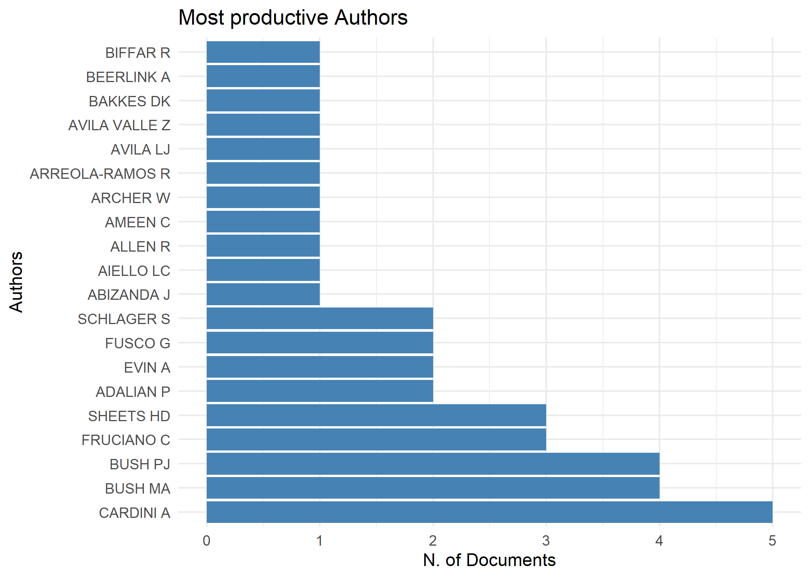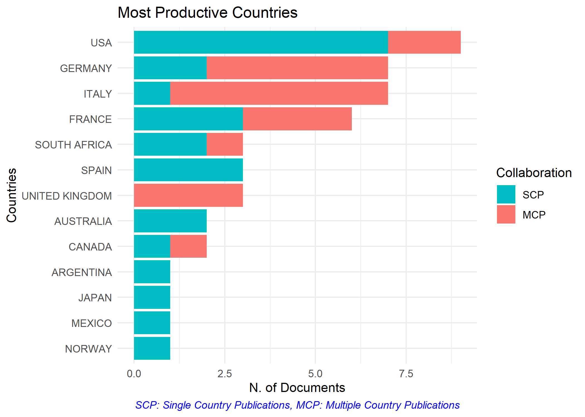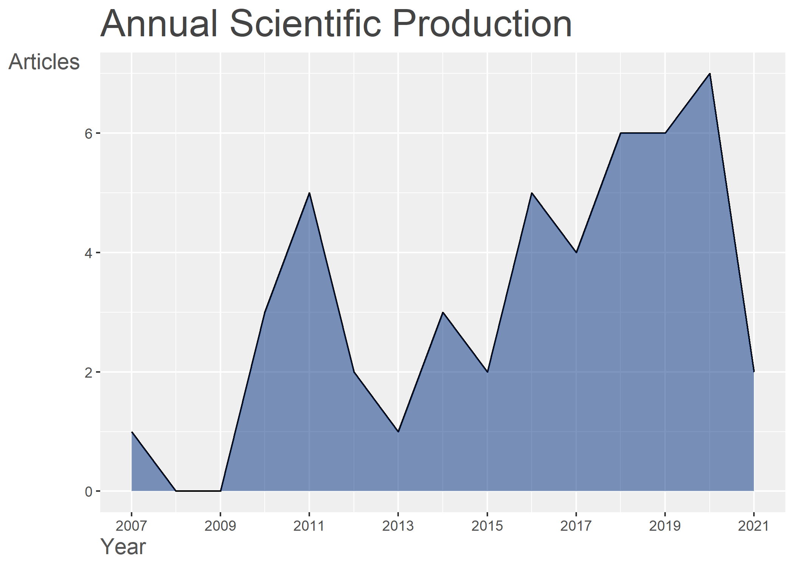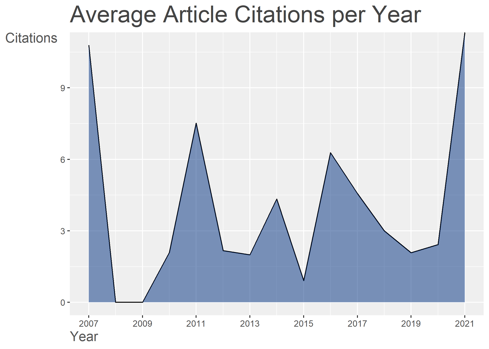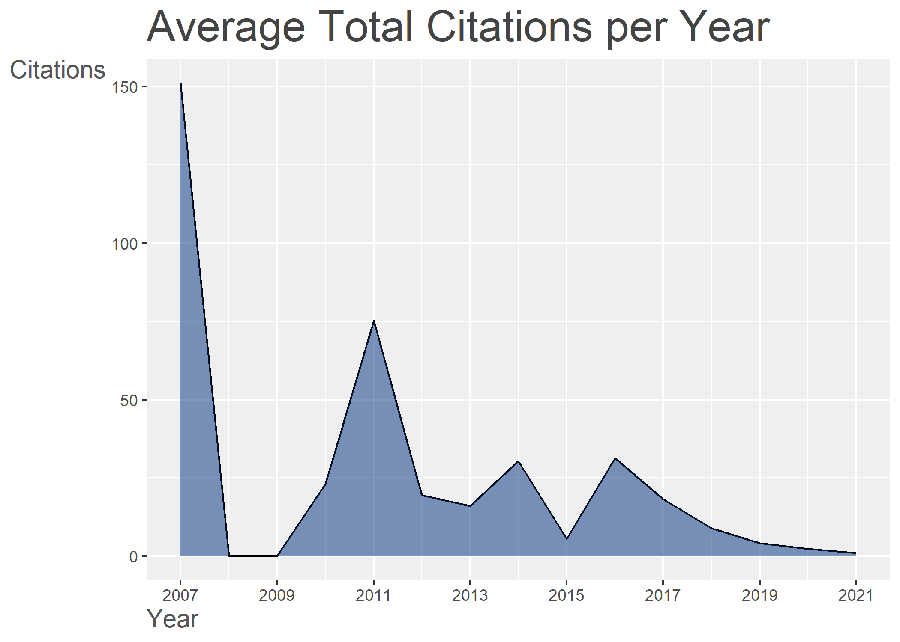

### Attributes of the local network

``` r
# calculate citations in local network
CR <- localCitations(df, sep = ";")

# top 20 cited authors in local network
CR$Authors[1:20,]
```

    ##              Author LocalCitations
    ## 28     CORNELIUS CP             14
    ## 48        ELLIS III             14
    ## 54    FUESSINGER MA             14
    ## 58           GASS M             14
    ## 105      METZGER MC             14
    ## 126        PROBST F             14
    ## 143      SCHLAGER S             14
    ## 146       SCHWARZ S             14
    ## 147   SEMPER-HOGG W             14
    ## 7   ARREOLA-RAMOS R             13
    ## 8          AVILA LJ             13
    ## 79        HUESA EGD             13
    ## 109       MORANDO M             13
    ## 137      SANCHEZ KI             13
    ## 164      VILLAGRA A             13
    ## 169      VRDOLJAK J             13
    ## 34        DARWIN BC             10
    ## 42         DEVINE J             10
    ## 67   HALLGRIMSSON B             10
    ## 73     HENKELMAN RM             10

``` r
# top 20 cited papers in local network
CR$Papers[1:20,]
```

    ##                                               Paper                              DOI Year LCS GCS
    ## 28                 FRUCIANO C, 2016, DEV GENES EVOL        10.1007/s00427-016-0537-4 2016  14  82
    ## 47 VON CRAMON-TAUBADEL N, 2007, AM J PHYS ANTHROPOL               10.1002/ajpa.20616 2007  13 151
    ## 35                         CARDINI A, 2014, HYSTRIX       10.4404/hystrix-25.2-10993 2014  10  74
    ## 23          FRUCIANO C, 2017, ECOLOGY AND EVOLUTION                10.1002/ece3.3256 2017   9  31
    ## 24            ROBINSON C, 2017, AM J PHYS ANTHROPOL               10.1002/ajpa.23257 2017   7  28
    ## 19                         DABOUL A, 2018, PLOS ONE     10.1371/journal.pone.0197675 2018   5  11
    ## 39                        VISCOSI V, 2011, PLOS ONE     10.1371/journal.pone.0025630 2011   5 221
    ## 26                 EVIN A, 2016, J ARCHAEOL SCI REP     10.1016/j.jasrep.2016.06.028 2016   4  50
    ## 8                 FRUCIANO C, 2020, ZOOL J LINN SOC        10.1093/zoolinnean/zlz069 2020   3   5
    ## 40                  BUSH MA, 2011, FORENSIC SCI INT  10.1016/j.forsciint.2011.03.028 2011   2  18
    ## 7               FOX NS, 2020, ECOLOGY AND EVOLUTION                10.1002/ece3.6063 2020   1   6
    ## 10                   ITO T, 2019, METHODS ECOL EVOL          10.1111/2041-210X.13274 2019   1   1
    ## 12                         ENGELKES K, 2019, J ANAT                10.1111/joa.12999 2019   1   7
    ## 25                 MENNDEZ LP, 2017, J FORENSIC SCI          10.1111/1556-4029.13301 2017   1   9
    ## 43                  SHEETS HD, 2011, J FORENSIC SCI 10.1111/j.1556-4029.2011.01731.x 2011   1  21
    ## 1                 VRDOLJAK J, 2021, BIOL J LINN SOC       10.1093/BIOLINNEAN/BLAA079 2021   0   2
    ## 2                 EVIN A, 2021, BIOL METHODS PROTOC       10.1093/biomethods/bpaa023 2021   0   0
    ## 3      JASSO-CULLAR J, 2020, FOREN SCI INTERNAT REP       10.1016/j.fsir.2020.100161 2020   0   0
    ## 4                      COURTENAY LA, 2020, PLOS ONE     10.1371/journal.pone.0240328 2020   0   3
    ## 5                    WASILJEW BD, 2020, J FISH BIOL                10.1111/jfb.14410 2020   0   0

``` r
# top authors' productivity over time
topAU <- authorProdOverTime(df, 
                            k = 20, 
                            graph = TRUE)
```

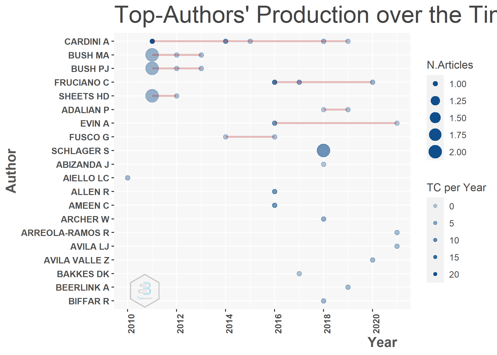

``` r
# number of documents published annually by top sources
topSO <- sourceGrowth(df, 
                      top = 8, 
                      cdf = TRUE)
topSO
```

    ##      Year AMERICAN JOURNAL OF PHYSICAL ANTHROPOLOGY PLOS ONE FORENSIC SCIENCE INTERNATIONAL JOURNAL OF ANATOMY
    ## 2007 2007                                         1        0                              0                  0
    ## 2008 2008                                         1        0                              0                  0
    ## 2009 2009                                         1        0                              0                  0
    ## 2010 2010                                         2        0                              0                  0
    ## 2011 2011                                         4        1                              1                  0
    ## 2012 2012                                         4        1                              2                  0
    ## 2013 2013                                         4        1                              2                  0
    ## 2014 2014                                         5        1                              2                  0
    ## 2015 2015                                         5        2                              2                  0
    ## 2016 2016                                         5        2                              2                  1
    ## 2017 2017                                         6        2                              2                  1
    ## 2018 2018                                         7        3                              2                  1
    ## 2019 2019                                         7        3                              2                  3
    ## 2020 2020                                         7        4                              3                  3
    ## 2021 2021                                         7        4                              3                  3
    ##      JOURNAL OF FORENSIC SCIENCES ARCHAEOLOGICAL AND ANTHROPOLOGICAL SCIENCES DEVELOPMENT GENES AND EVOLUTION
    ## 2007                            0                                           0                               0
    ## 2008                            0                                           0                               0
    ## 2009                            0                                           0                               0
    ## 2010                            0                                           0                               0
    ## 2011                            1                                           0                               0
    ## 2012                            1                                           0                               0
    ## 2013                            2                                           0                               0
    ## 2014                            2                                           0                               0
    ## 2015                            2                                           0                               0
    ## 2016                            2                                           0                               2
    ## 2017                            3                                           0                               2
    ## 2018                            3                                           1                               2
    ## 2019                            3                                           1                               2
    ## 2020                            3                                           2                               2
    ## 2021                            3                                           2                               2
    ##      ECOLOGY AND EVOLUTION
    ## 2007                     0
    ## 2008                     0
    ## 2009                     0
    ## 2010                     0
    ## 2011                     0
    ## 2012                     0
    ## 2013                     0
    ## 2014                     0
    ## 2015                     0
    ## 2016                     0
    ## 2017                     1
    ## 2018                     1
    ## 2019                     1
    ## 2020                     2
    ## 2021                     2

``` r
# plot results
tso = melt(topSO, id = 'Year')
ggplot(tso, aes(Year, value, group = variable, color = variable)) + 
  geom_line()
```

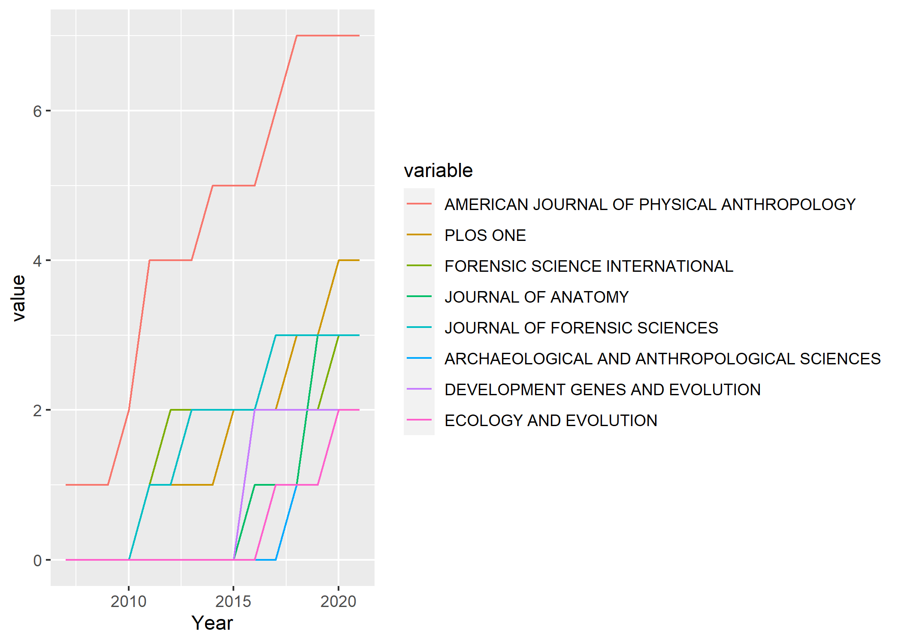

## Most cited

### Most cited articles

``` r
# most cited references in global network
mcr <- citations(df, 
                 field = "article", 
                 sep = ";")
cbind(mcr$Cited[1:20])
```

    ##                                                                                                                                                                                                                             [,1]
    ## KLINGENBERG, C.P., BARLUENGA, M., MEYER, A., SHAPE ANALYSIS OF SYMMETRIC STRUCTURES: QUANTIFYING VARIATION AMONG INDIVIDUALS AND ASYMMETRY (2002) EVOLUTION, 56, PP. 1909-1920                                                 6
    ## KLINGENBERG, C.P., MCINTYRE, G.S., GEOMETRIC MORPHOMETRICS OF DEVELOPMENTAL INSTABILITY: ANALYZING PATTERNS OF FLUCTUATING ASYMMETRY WITH PROCRUSTES METHODS (1998) EVOLUTION, 52, PP. 1363-1375                               5
    ## KLINGENBERG, C.P., MORPHOJ: AN INTEGRATED SOFTWARE PACKAGE FOR GEOMETRIC MORPHOMETRICS (2011) MOLECULAR ECOLOGY RESOURCES, 11, PP. 353-357                                                                                     4
    ## LOCKWOOD, C.A., LYNCH, J.M., KIMBEL, W.H., QUANTIFYING TEMPORAL BONE MORPHOLOGY OF GREAT APES AND HUMANS: AN APPROACH USING GEOMETRIC MORPHOMETRICS (2002) J ANAT, 201, PP. 447-464                                            4
    ## ROHLF, F.J., MARCUS, L.F., A REVOLUTION IN MORPHOMETRICS (1993) TRENDS ECOL EVOL, 8, PP. 129-132                                                                                                                               4
    ## ADAMS, D.C., ROHLF, F.J., SLICE, D.E., GEOMETRIC MORPHOMETRICS: TEN YEARS OF PROGRESS FOLLOWING THE REVOLUTION (2004) ITAL J ZOOL, 71, PP. 5-16                                                                                3
    ## BOOKSTEIN, F.L., (1991) MORPHOMETRIC TOOLS FOR LANDMARK DATA: GEOMETRY AND BIOLOGY, , CAMBRIDGE UNIVERSITY PRESS, CAMBRIDGE                                                                                                    3
    ## BOOKSTEIN, F.L., LANDMARK METHODS FOR FORMS WITHOUT LANDMARKS: MORPHOMETRICS OF GROUP DIFFERENCES IN OUTLINE SHAPE (1997) MEDICAL IMAGE ANALYSIS, 1, PP. 225-243                                                               3
    ## BUSER, T.J., SIDLAUSKAS, B.L., SUMMERS, A.P., 2D OR NOT 2D? TESTING THE UTILITY OF 2D VS. 3D LANDMARK DATA IN GEOMETRIC MORPHOMETRICS OF THE SCULPIN SUBFAMILY OLIGOCOTTINAE (PISCES                                           3
    ## CARDINI, A., ELTON, S., SAMPLE SIZE AND SAMPLING ERROR IN GEOMETRIC MORPHOMETRIC STUDIES OF SIZE AND SHAPE (2007) ZOOMORPHOLOGY, 126, PP. 121-134                                                                              3
    ## FRUCIANO, C., MEASUREMENT ERROR IN GEOMETRIC MORPHOMETRICS (2016) DEV GENES EVOL, 226, PP. 139-158                                                                                                                             3
    ## FRUCIANO, C., MEASUREMENT ERROR IN GEOMETRIC MORPHOMETRICS (2016) DEVELOPMENT GENES AND EVOLUTION, 226, PP. 139-158                                                                                                            3
    ## KLINGENBERG, C.P., BARLUENGA, M., MEYER, A., SHAPE ANALYSIS OF SYMMETRIC STRUCTURES: QUANTIFYING VARIATION AMONG INDIVIDUALS AND ASYMMETRY (2002) EVOLUTION, 56, PP. 1909-1920. , PID: 12449478                                3
    ## KLINGENBERG, C.P., MONTEIRO, L.R., DISTANCES AND DIRECTIONS IN MULTIDIMENSIONAL SHAPE SPACES: IMPLICATIONS FOR MORPHOMETRIC APPLICATIONS (2005) SYST BIOL, 54, PP. 678-688                                                     3
    ## MITTEROECKER, P., GUNZ, P., ADVANCES IN GEOMETRIC MORPHOMETRICS (2009) EVOL BIOL, 36, PP. 235-247                                                                                                                              3
    ## ROHLF, F.J., THE TPS SERIES OF SOFTWARE (2015) HYSTRIX, THE ITALIAN JOURNAL OF MAMMALOGY, 26, PP. 9-12                                                                                                                         3
    ## SLICE, D.E., GEOMETRIC MORPHOMETRICS (2007) ANNU REV ANTHROPOL, 36, PP. 261-281                                                                                                                                                3
    ## VON CRAMON-TAUBADEL, N., FRAZIER, B.C., LAHR, M.M., THE PROBLEM OF ASSESSING LANDMARK ERROR IN GEOMETRIC MORPHOMETRICS: THEORY, METHODS, AND MODIFICATIONS (2007) AMERICAN JOURNAL OF PHYSICAL ANTHROPOLOGY, 134, PP. 24-35    3
    ## (2008) R: A LANGUAGE AND ENVIRONMENT FOR STATISTICAL COMPUTING, , VIENNA, R FOUNDATION FOR STATISTICAL COMPUTING                                                                                                               2
    ## ADAMS, D.C., COLLYER, M.L., PERMUTATION TESTS FOR PHYLOGENETIC COMPARATIVE ANALYSES OF HIGH-DIMENSIONAL SHAPE DATA: WHAT YOU SHUFFLE MATTERS (2015) EVOLUTION, 69 (3), PP. 823-829                                             2

### Most cited authors

``` r
# most cited authors in global network
mcr <- citations(df, 
                 field = "author", 
                 sep = ";")
cbind(mcr$Cited[1:20])
```

    ##                 [,1]
    ## ROHLF F J        122
    ## KLINGENBERG C P   89
    ## BOOKSTEIN F L     82
    ## CARDINI A         68
    ## FRUCIANO C        59
    ## ADAMS D C         56
    ## SLICE D E         56
    ## SHEETS H D        42
    ## MITTEROECKER P    37
    ## GUNZ P            33
    ## O HIGGINS P       30
    ## MEYER A           26
    ## BUSH M A          22
    ## RICHTSMEIER J T   22
    ## BERNAL V          20
    ## ZELDITCH M L      20
    ## SWIDERSKI D L     19
    ## BUSH P J          18
    ## MARCUS L F        18
    ## MARDIA K V        17

### Author dominance ranking

``` r
dom <- biblioAnalysis(df)
dom.r <- dominance(dom)
dom.r
```

    ##            Author Dominance Factor Tot Articles Single-Authored Multi-Authored First-Authored Rank by Articles
    ## 1      FRUCIANO C        1.0000000            3               1              2              2                2
    ## 2          EVIN A        1.0000000            2               0              2              2                4
    ## 3        ARCHER W        1.0000000            1               0              1              1                5
    ## 4         CORNY J        1.0000000            1               0              1              1                5
    ## 5       COSMAN MN        1.0000000            1               0              1              1                5
    ## 6    COURTENAY LA        1.0000000            1               0              1              1                5
    ## 7        DABOUL A        1.0000000            1               0              1              1                5
    ## 8  DAVID SHEETS H        1.0000000            1               0              1              1                5
    ## 9       SHEETS HD        0.6666667            3               0              3              2                2
    ## 10        BUSH MA        0.2500000            4               0              4              1                1
    ##    Rank by DF
    ## 1           1
    ## 2           1
    ## 3           1
    ## 4           1
    ## 5           1
    ## 6           1
    ## 7           1
    ## 8           1
    ## 9           9
    ## 10         10

## Intellectual structure

### Author co-citation

Co-citation analysis is the most commonly used bibliometric analysis
method (Ding, Chowdhury, and Foo 2001), and is defined as two
publications that are cited together in one article (Small 1973).

``` r
# extract author names from reference items
df <- metaTagExtraction(df,
                        Field = "CR_AU")

# author co-citation network
auth.co.mat <- biblioNetwork(df, 
                             analysis = "co-citation", 
                             network = "authors", 
                             sep = ";")

# network plot
auth.co.net = networkPlot(auth.co.mat, 
                          n = 50, 
                          Title = "Author Co-Citation Network", 
                          type = "auto", 
                          size = 10, 
                          size.cex = T, 
                          remove.multiple = FALSE, 
                          labelsize = 0.5, 
                          edgesize = 8, 
                          edges.min = 3, 
                          remove.isolates = TRUE)
```

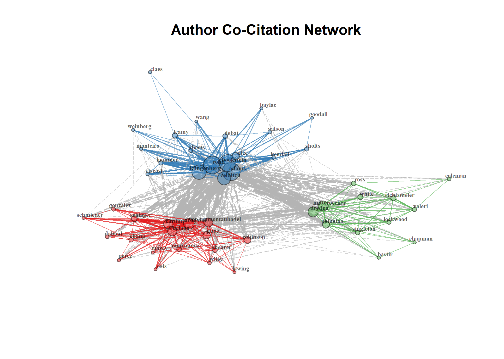

``` r
# descriptive analysis of author co-citation network
auth.co.netstat <- networkStat(auth.co.mat)
summary(auth.co.netstat, k = 15)
```

    ## 
    ## 
    ## Main statistics about the network
    ## 
    ##  Size                                  1283 
    ##  Density                               0.063 
    ##  Transitivity                          0.449 
    ##  Diameter                              3 
    ##  Degree Centralization                 0.689 
    ##  Average path length                   1.98 
    ## 

### Author coupling

Coupling is a similarity measure that uses citation analysis to
illustrate a similarity relationship between documents. Author coupling
occurs when two authors reference a common third author in their
bibliographies.

``` r
# author coupling network
auth.coup.mat <- biblioNetwork(df, 
                             analysis = "coupling", 
                             network = "authors", 
                             sep = ";")

# network plot
auth.coup.net = networkPlot(auth.coup.mat, 
                          n = 50, 
                          Title = "Author Coupling Network", 
                          type = "mds", 
                          size = 10, 
                          size.cex = T,
                          remove.multiple = FALSE, 
                          labelsize = 0.5, 
                          edgesize = 5, 
                          edges.min = 8, 
                          remove.isolates = TRUE)
```

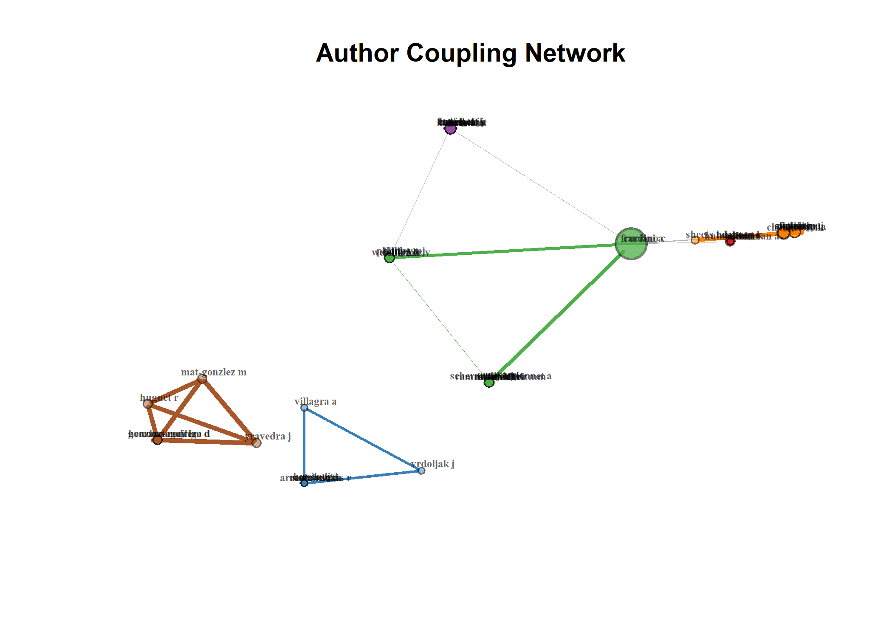

``` r
# descriptive analysis of author coupling network
auth.coup.netstat <- networkStat(auth.coup.mat)
summary(auth.coup.netstat, k = 15)
```

    ## 
    ## 
    ## Main statistics about the network
    ## 
    ##  Size                                  177 
    ##  Density                               0.48 
    ##  Transitivity                          0.696 
    ##  Diameter                              3 
    ##  Degree Centralization                 0.463 
    ##  Average path length                   1.543 
    ## 

## Historiograph direct citation linkages

The historiographic map is a chronological network map of the most
relevant direct citations resulting from this bibliographic collection.

``` r
# historical citation network
options(width = 100)
histResults <- histNetwork(df, 
                           min.citations = 10, 
                           sep = ";")
```

    ## 
    ## SCOPUS DB: Searching local citations (LCS) by document titles (TI) and DOIs...
    ## 
    ## Found 10 documents with no empty Local Citations (LCS)

``` r
# plot historical co-citation network
hnet <- histPlot(histResults, 
                 n = 100, 
                 size = 6, 
                 labelsize = 2)
```

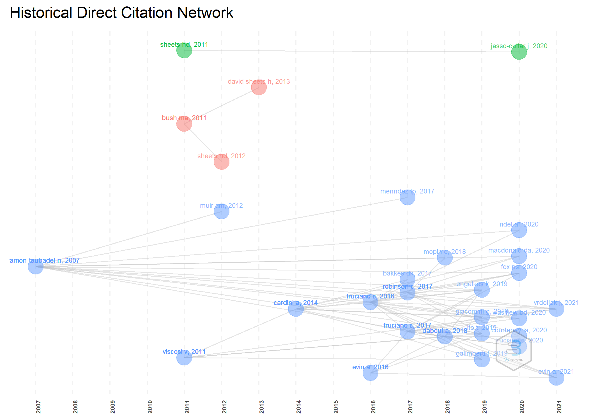

    ## 
    ##  Legend
    ## 
    ##                                               Label                              DOI Year LCS GCS
    ## 1                          DABOUL A, 2018, PLOS ONE     10.1371/journal.pone.0197675 2018   5  11
    ## 2           FRUCIANO C, 2017, ECOLOGY AND EVOLUTION                10.1002/ece3.3256 2017   9  31
    ## 3             ROBINSON C, 2017, AM J PHYS ANTHROPOL               10.1002/ajpa.23257 2017   7  28
    ## 4                  EVIN A, 2016, J ARCHAEOL SCI REP     10.1016/j.jasrep.2016.06.028 2016   4  50
    ## 5                  FRUCIANO C, 2016, DEV GENES EVOL        10.1007/s00427-016-0537-4 2016  14  82
    ## 6                          CARDINI A, 2014, HYSTRIX       10.4404/hystrix-25.2-10993 2014  10  74
    ## 7                         VISCOSI V, 2011, PLOS ONE     10.1371/journal.pone.0025630 2011   5 221
    ## 8                   BUSH MA, 2011, FORENSIC SCI INT  10.1016/j.forsciint.2011.03.028 2011   2  18
    ## 9                   SHEETS HD, 2011, J FORENSIC SCI 10.1111/j.1556-4029.2011.01731.x 2011   1  21
    ## 10 VON CRAMON-TAUBADEL N, 2007, AM J PHYS ANTHROPOL               10.1002/ajpa.20616 2007  13 151
    ## 11                EVIN A, 2021, BIOL METHODS PROTOC       10.1093/biomethods/bpaa023 2021   0   0
    ## 12                     COURTENAY LA, 2020, PLOS ONE     10.1371/journal.pone.0240328 2020   0   3
    ## 13                FRUCIANO C, 2020, ZOOL J LINN SOC        10.1093/zoolinnean/zlz069 2020   0   5
    ## 14                         ENGELKES K, 2019, J ANAT                10.1111/joa.12999 2019   0   7
    ## 15         GALIMBERTI F, 2019, J ZOOL SYST EVOL RES                10.1111/jzs.12276 2019   0   2
    ## 16                VRDOLJAK J, 2021, BIOL J LINN SOC       10.1093/BIOLINNEAN/BLAA079 2021   0   2
    ## 17                   WASILJEW BD, 2020, J FISH BIOL                10.1111/jfb.14410 2020   0   0
    ## 18              FOX NS, 2020, ECOLOGY AND EVOLUTION                10.1002/ece3.6063 2020   0   6
    ## 19                   ITO T, 2019, METHODS ECOL EVOL          10.1111/2041-210X.13274 2019   0   1
    ## 20                     GIACOMINI G, 2019, EVOL BIOL       10.1007/s11692-019-09478-6 2019   0   8
    ## 21               MOPIN C, 2018, AM J PHYS ANTHROPOL               10.1002/ajpa.23613 2018   0   0
    ## 22       MACDONALD DA, 2020, ARCHAEOL ANTHROPOL SCI       10.1007/s12520-020-01111-4 2020   0   0
    ## 23                 RIDEL AF, 2020, FORENSIC SCI INT  10.1016/j.forsciint.2019.110095 2020   0   3
    ## 24                   BAKKES DK, 2017, ZOOMORPHOLOGY        10.1007/s00435-017-0357-8 2017   0   5
    ## 25             DAVID SHEETS H, 2013, J FORENSIC SCI 10.1111/j.1556-4029.2012.02293.x 2013   0  16
    ## 26                SHEETS HD, 2012, FORENSIC SCI INT  10.1016/j.forsciint.2012.08.044 2012   0   8
    ## 27     JASSO-CULLAR J, 2020, FOREN SCI INTERNAT REP       10.1016/j.fsir.2020.100161 2020   0   0
    ## 28                 MENNDEZ LP, 2017, J FORENSIC SCI          10.1111/1556-4029.13301 2017   0   9
    ## 29                 MUIR AM, 2012, TRANS AM FISH SOC     10.1080/00028487.2012.685823 2012   0  31

### ID and DE keyword associations

``` r
list <- keywordAssoc(df, 
                     sep = ";", 
                     n = 10)

list[[1]][1:10]
```

    ##         GEOMETRIC MORPHOMETRICS                FORENSIC SCIENCE                       BITEMARKS 
    ##                               8                               5                               4 
    ##             FORENSIC ODONTOLOGY               MEASUREMENT ERROR GEOMETRIC MORPHOMETRIC ANALYSIS 
    ##                               4                               3                               3 
    ##           FLUCTUATING ASYMMETRY                   MORPHOMETRICS               BITEMARK RESEARCH 
    ##                               2                               2                               2 
    ##               DENTAL UNIQUENESS 
    ##                               2

### Yearly occurrences of top keywords/terms

#### Authors’ keywords

``` r
topKW = KeywordGrowth(df, 
                      Tag = "DE", 
                      sep = ";", 
                      top = 10, 
                      cdf = TRUE)

topKW
```

    ##    Year GEOMETRIC MORPHOMETRICS MEASUREMENT ERROR FORENSIC SCIENCE LANDMARKS BITEMARKS
    ## 1  2007                       0                 1                0         0         0
    ## 2  2008                       0                 1                0         0         0
    ## 3  2009                       0                 1                0         0         0
    ## 4  2010                       2                 1                0         0         0
    ## 5  2011                       4                 1                2         1         2
    ## 6  2012                       4                 1                3         1         3
    ## 7  2013                       4                 1                4         1         4
    ## 8  2014                       6                 2                4         2         4
    ## 9  2015                       7                 2                4         2         4
    ## 10 2016                      11                 3                4         2         4
    ## 11 2017                      14                 6                5         2         4
    ## 12 2018                      14                 6                5         3         4
    ## 13 2019                      18                10                5         4         4
    ## 14 2020                      23                11                6         5         4
    ## 15 2021                      25                13                6         5         4
    ##    FORENSIC ODONTOLOGY FLUCTUATING ASYMMETRY GEOMETRIC MORPHOMETRIC ANALYSIS MORPHOMETRICS
    ## 1                    0                     0                               0             1
    ## 2                    0                     0                               0             1
    ## 3                    0                     0                               0             1
    ## 4                    0                     1                               0             2
    ## 5                    2                     1                               1             2
    ## 6                    3                     1                               2             2
    ## 7                    4                     1                               3             2
    ## 8                    4                     1                               3             2
    ## 9                    4                     1                               3             2
    ## 10                   4                     2                               3             2
    ## 11                   4                     2                               3             2
    ## 12                   4                     3                               3             2
    ## 13                   4                     3                               3             2
    ## 14                   4                     3                               3             3
    ## 15                   4                     3                               3             3
    ##    PHOTOGRAMMETRY
    ## 1               0
    ## 2               0
    ## 3               0
    ## 4               1
    ## 5               1
    ## 6               1
    ## 7               1
    ## 8               1
    ## 9               1
    ## 10              2
    ## 11              3
    ## 12              3
    ## 13              3
    ## 14              3
    ## 15              3

``` r
# plot results
key.plot = melt(topKW, 
                id ='Year')

ggplot(key.plot, aes(Year, 
                     value, 
                     group = variable, 
                     color = variable)) + 
  geom_line()
```

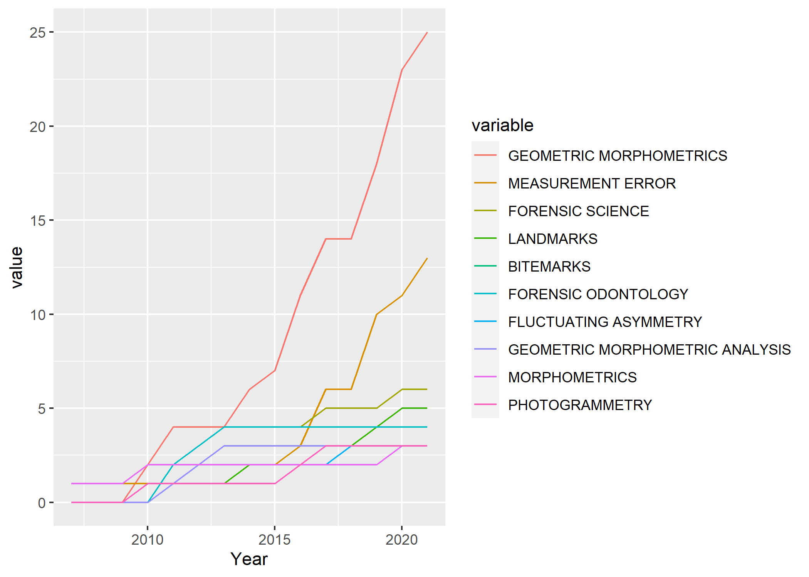

#### Publisher’s keywords

``` r
topKW = KeywordGrowth(df, 
                      Tag = "ID", 
                      sep = ";", 
                      top = 10, 
                      cdf = TRUE)

topKW
```

    ##    Year ARTICLE MALE FEMALE HUMAN MEASUREMENT ERROR ADULT HUMANS ANATOMY AND HISTOLOGY MORPHOMETRY
    ## 1  2007       1    0      0     0                 0     0      0                     0           0
    ## 2  2008       1    0      0     0                 0     0      0                     0           0
    ## 3  2009       1    0      0     0                 0     0      0                     0           0
    ## 4  2010       2    1      1     2                 1     0      2                     1           1
    ## 5  2011       7    4      4     7                 5     1      5                     1           1
    ## 6  2012       8    4      4     9                 6     1      6                     1           1
    ## 7  2013       9    4      4    11                 6     1      7                     1           1
    ## 8  2014      10    4      4    12                 7     1      8                     1           2
    ## 9  2015      11    8      8    13                 8     3      9                     3           3
    ## 10 2016      14   12     12    14                12     5     10                     5           3
    ## 11 2017      15   13     12    15                13     6     11                     7           4
    ## 12 2018      19   20     19    18                17    13     14                     9           8
    ## 13 2019      21   22     21    19                19    16     15                    12          10
    ## 14 2020      24   24     23    23                22    18     17                    15          13
    ## 15 2021      24   24     23    23                22    18     17                    15          14
    ##    PRINCIPAL COMPONENT ANALYSIS
    ## 1                             0
    ## 2                             0
    ## 3                             0
    ## 4                             2
    ## 5                             6
    ## 6                             6
    ## 7                             8
    ## 8                             8
    ## 9                             8
    ## 10                            9
    ## 11                           11
    ## 12                           11
    ## 13                           11
    ## 14                           14
    ## 15                           14

``` r
# plot results
key.plot = melt(topKW, 
                id ='Year')

ggplot(key.plot, aes(Year, 
                     value, 
                     group = variable, 
                     color = variable)) + 
  geom_line()
```

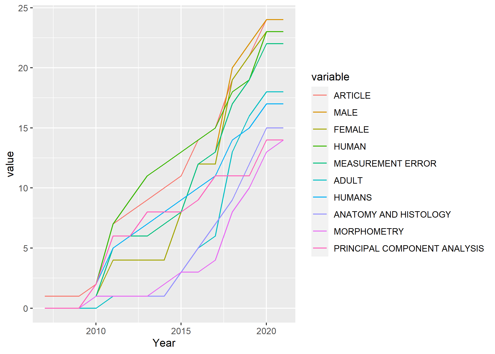

## Conceptual structure

### Co-word analysis

The co-word analysis maps the conceptual structure of a research domain
using the co-occurrence of author keywords in the bibliographic
collection.

#### Authors’ keywords

``` r
# using authors keywords
cw <- conceptualStructure(df, 
                          field = "DE", 
                          method = "MDS", 
                          minDegree = 2, 
                          clust = "auto", 
                          stemming = FALSE, 
                          labelsize = 10, 
                          documents = 50)
```

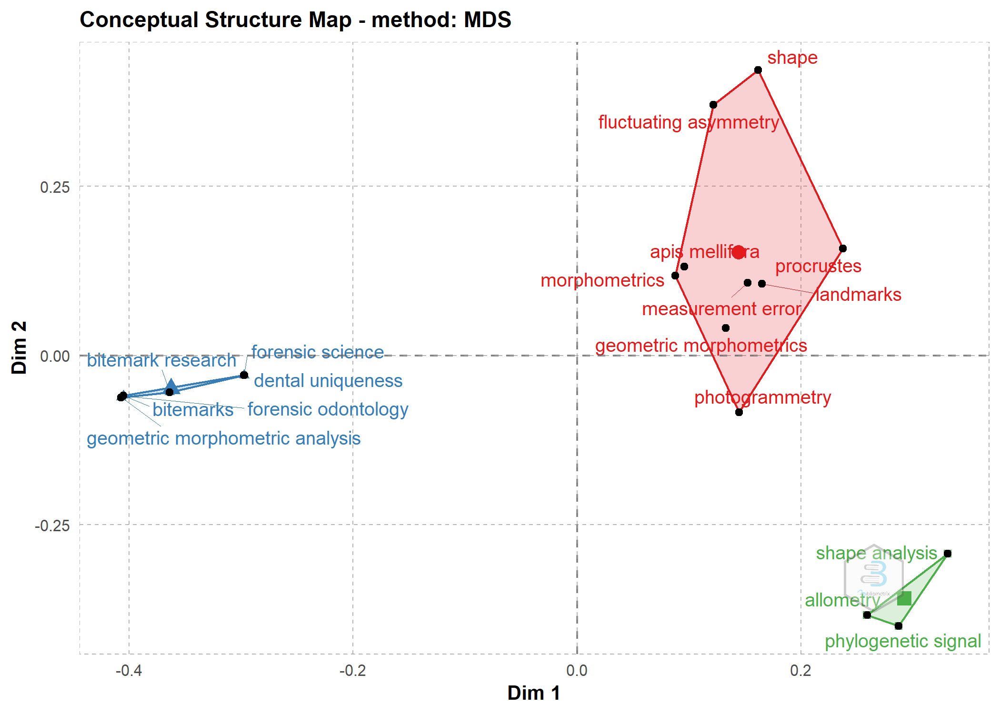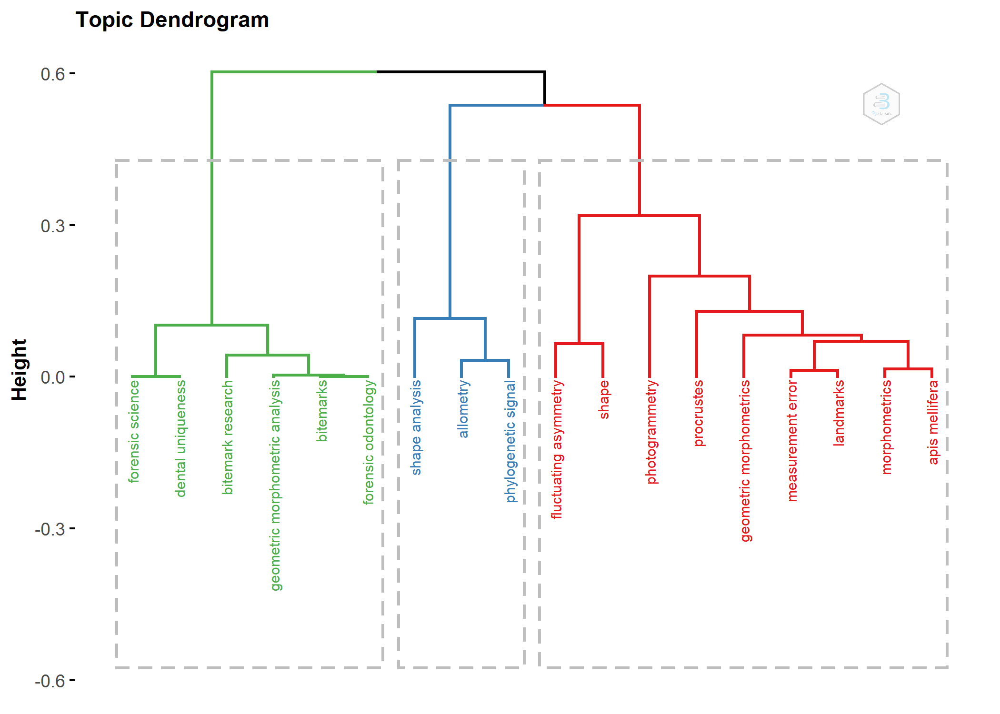

#### Publisher’s keywords

``` r
# using publishers keywords
cw <- conceptualStructure(df, 
                          field = "ID", 
                          method = "MDS", 
                          minDegree = 2, 
                          clust = "auto", 
                          stemming = FALSE, 
                          labelsize = 6, 
                          documents = 50)
```

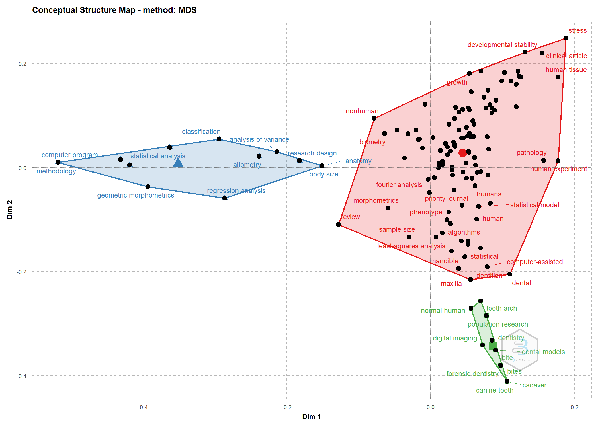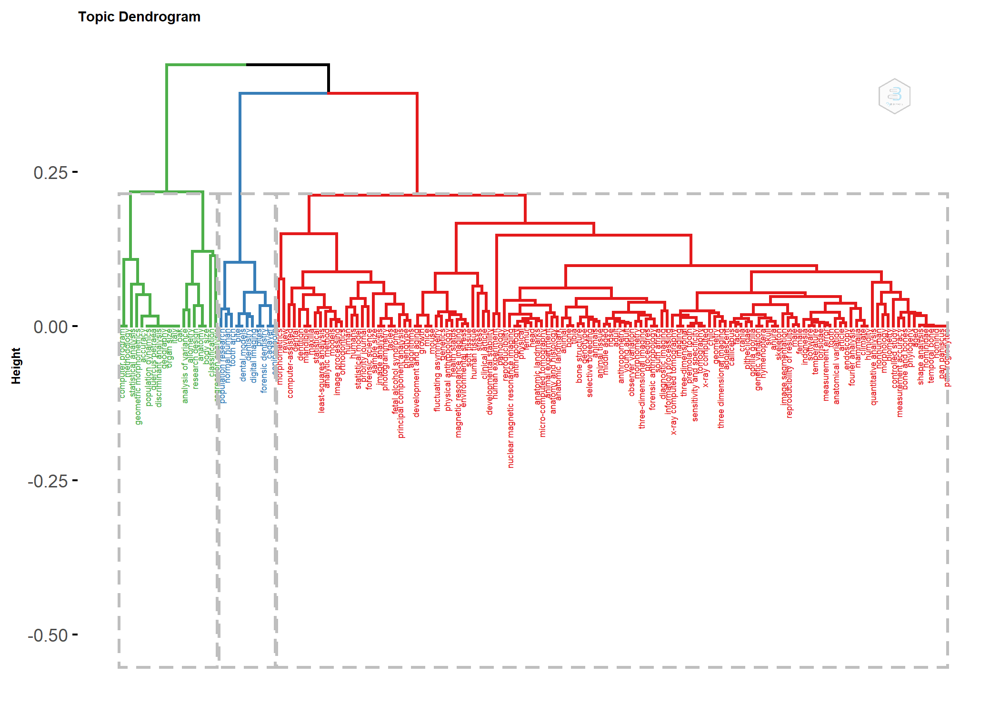

## Thematic mapping

From (Cobo et al. 2011, 150–51):

-   Themes in the upper-right quadrant are both well developed and
    important for the structuring ofa research field. They are known as
    the motor-themes of the specialty, given that they present strong
    centrality and high density. The placement of themesin this
    quadrantimplies that theyare related externally to concepts
    applicable to otherthemesthat are conceptually closely related.
-   Themes in the upper-left quadrant have well developed internal ties
    but unimportant external ties and so are of only marginal importance
    for the field. These themes are very specialized and peripheral in
    character.
-   Themes in the lower-left quadrant are both weakly developed and
    marginal. The themes ofthis quadrant have low density and low
    centrality, mainly representing either emerging or disappearing
    themes.
-   Themes in the lower-right quadrant are important for a research
    field but are not developed. So, this quadrant groups transversal
    and general, basic themes.

### Authors’ keywords

``` r
# keyword map
map1 = thematicMap(df, 
                   field = "DE", 
                   n = 1000, 
                   minfreq = 3, 
                   stemming = FALSE, 
                   size = 0.8, 
                   n.labels = 1, 
                   repel = TRUE)

# plot map
plot(map1$map)
```

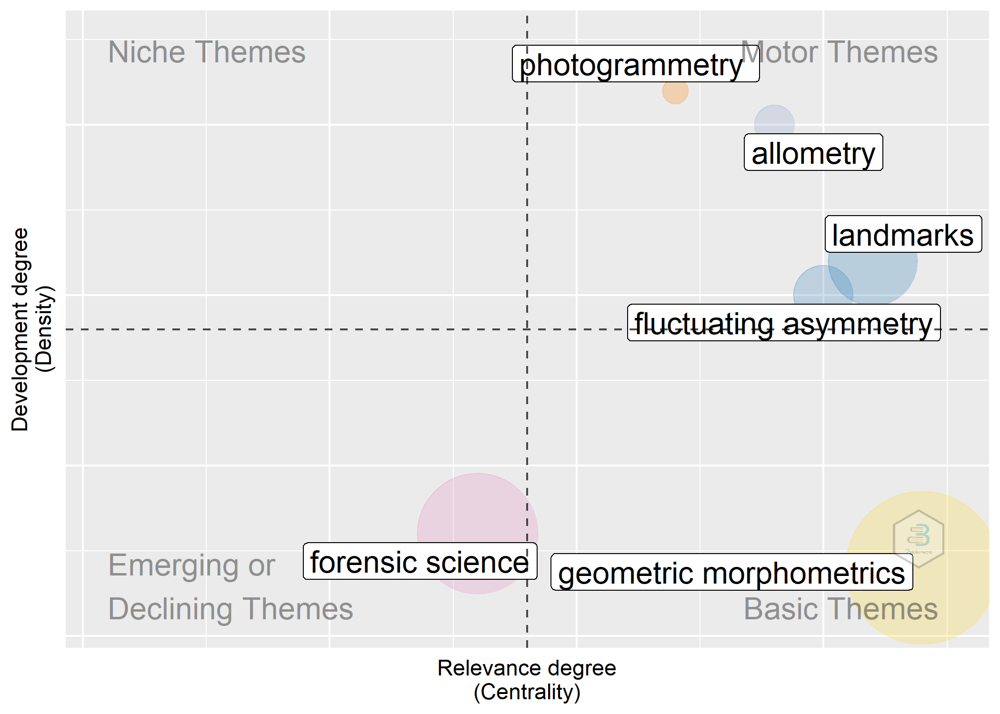

### Publisher’s keywords

``` r
# keyword map
map1 = thematicMap(df, 
                   field = "ID", 
                   n = 1000,
                   minfreq = 3, 
                   stemming = FALSE, 
                   size = 0.8, 
                   n.labels = 1, 
                   repel = TRUE)

# plot map
plot(map1$map)
```

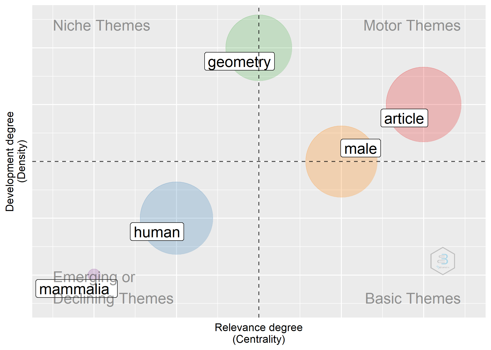

## Social structure

### Author collaboration

Scientific collaborations are plotted where nodes are authors and links
are co-authorships, illustrating collaborations between authors.

``` r
# author collaboration network
auth.collab <- biblioNetwork(df, 
                             analysis = "collaboration", 
                             network = "authors", 
                             sep = ";")

# network plot
auth.collabnet = networkPlot(auth.collab, 
                             n = 100, 
                             Title = "Author Collaboration", 
                             type = "mds", 
                             size = 20, 
                             size.cex = T,
                             edgesize = 2, 
                             labelsize = 0.5,
                             remove.multiple = TRUE,
                             remove.isolates = TRUE)
```

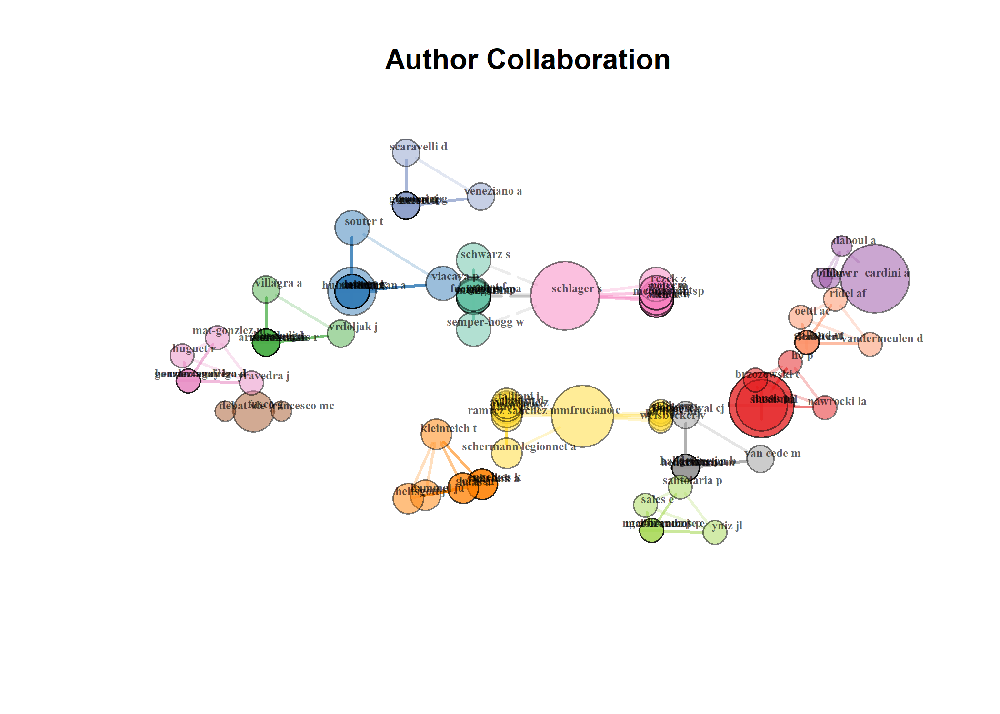

``` r
# descriptive analysis of author collaboration network
auth.collab.netstat <- networkStat(auth.collab)
summary(auth.collab.netstat, k = 15)
```

    ## 
    ## 
    ## Main statistics about the network
    ## 
    ##  Size                                  177 
    ##  Density                               0.027 
    ##  Transitivity                          0.913 
    ##  Diameter                              2 
    ##  Degree Centralization                 0.064 
    ##  Average path length                   1.303 
    ## 

### Edu collaboration

Scientific collaborations are plotted where nodes are institutions and
links are co-authorships, illustrating collaborations between
institutions.

``` r
# author collaboration network
edu.collab <- biblioNetwork(df, 
                            analysis = "collaboration", 
                            network = "universities",
                            sep = ";")

# network plot
edu.collabnet = networkPlot(edu.collab, 
                            n = 100, 
                            Title = "Edu Collaboration", 
                            type = "auto", 
                            size = 30, 
                            size.cex = T, 
                            edgesize = 2, 
                            labelsize = 0.4, 
                            remove.isolates = TRUE)
```

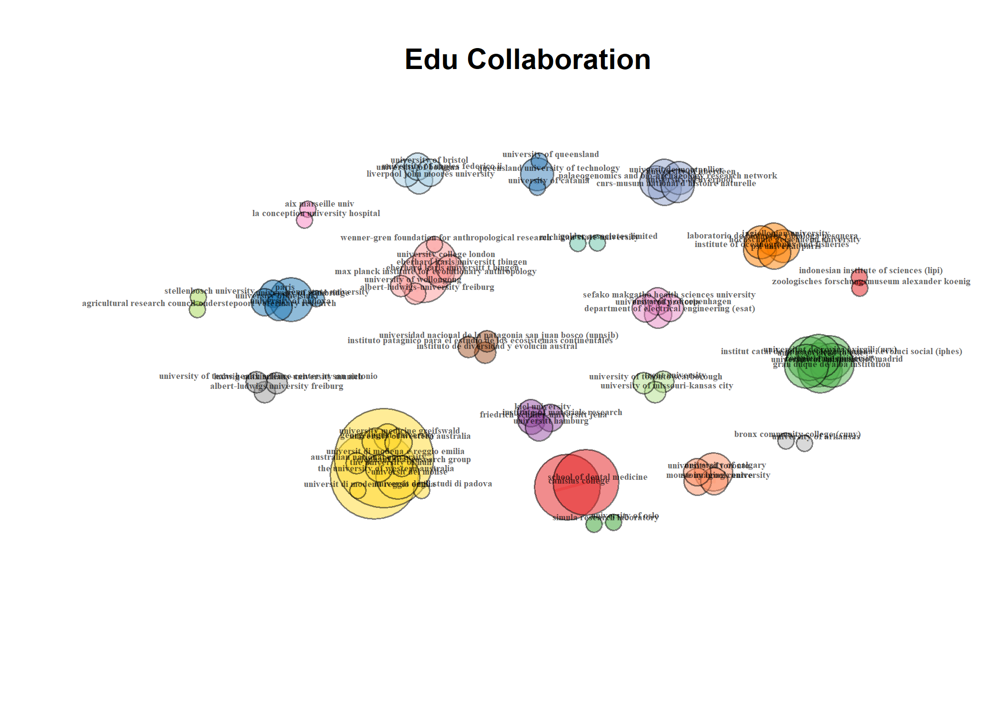

``` r
# descriptive analysis of edu collaboration network
edu.collab.netstat<-networkStat(edu.collab)
summary(edu.collab.netstat, k = 15)
```

    ## 
    ## 
    ## Main statistics about the network
    ## 
    ##  Size                                  95 
    ##  Density                               0.026 
    ##  Transitivity                          0.858 
    ##  Diameter                              3 
    ##  Degree Centralization                 0.059 
    ##  Average path length                   1.371 
    ## 

### Country collaboration

``` r
# country collaboration network
count <- metaTagExtraction(df, 
                           Field = "AU_CO", 
                           sep = ";")

cmat1 <- biblioNetwork(count, 
                       analysis = "collaboration", 
                       network = "countries", 
                       sep = ";")

# network plot
cnet1 = networkPlot(cmat1, 
                    n = dim(cmat1)[1], 
                    Title = "Country Collaboration", 
                    type = "circle", 
                    size = 10, 
                    size.cex = T, 
                    edgesize = 1, 
                    labelsize = 0.6, 
                    cluster = "none")
```

<div class="figure">

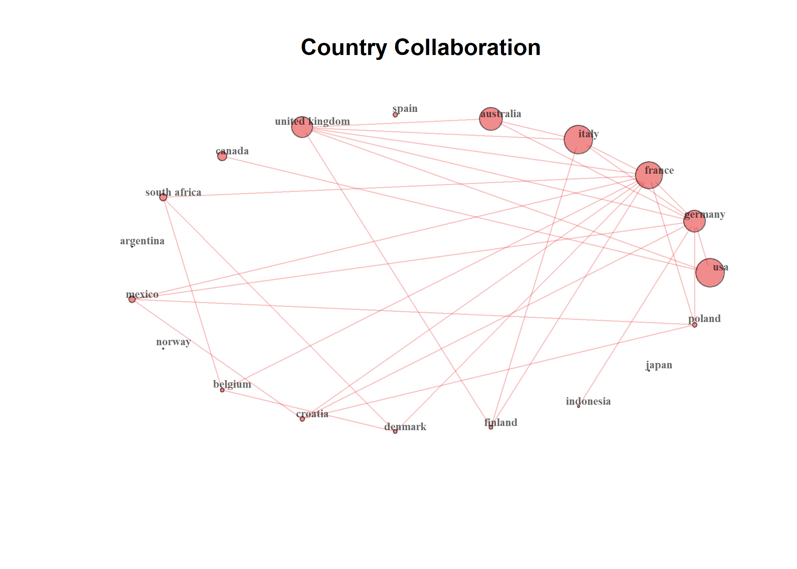
<p class="caption">
In this figure, scientific collaborations are plotted where nodes are
countries and links are co-authorships, illustrating collaborations
between countries
</p>

</div>

``` r
# descriptive analysis of country collaboration network
countnetstat <- networkStat(cmat1)
summary(countnetstat, k = 15)
```

    ## 
    ## 
    ## Main statistics about the network
    ## 
    ##  Size                                  19 
    ##  Density                               0.181 
    ##  Transitivity                          0.528 
    ##  Diameter                              4 
    ##  Degree Centralization                 0.374 
    ##  Average path length                   1.933 
    ## 

## Colophon

This version of the analysis was generated on 2021-05-24 03:46:30 using
the following computational environment and dependencies:

``` r
# what R packages and versions were used?
if ("devtools" %in% installed.packages()) devtools::session_info()
```

    ## - Session info -----------------------------------------------------------------------------------
    ##  setting  value                       
    ##  version  R version 4.0.5 (2021-03-31)
    ##  os       Windows 10 x64              
    ##  system   x86_64, mingw32             
    ##  ui       RTerm                       
    ##  language (EN)                        
    ##  collate  English_United States.1252  
    ##  ctype    English_United States.1252  
    ##  tz       America/Chicago             
    ##  date     2021-05-24                  
    ## 
    ## - Packages ---------------------------------------------------------------------------------------
    ##  package          * version  date       lib source                                   
    ##  abind              1.4-5    2016-07-21 [1] CRAN (R 4.0.0)                           
    ##  assertthat         0.2.1    2019-03-21 [1] CRAN (R 4.0.2)                           
    ##  backports          1.2.1    2020-12-09 [1] CRAN (R 4.0.3)                           
    ##  bibliometrix     * 3.1.1    2021-05-20 [1] Github (massimoaria/bibliometrix@2a7b6b8)
    ##  bibliometrixData   0.1.0    2020-12-10 [1] CRAN (R 4.0.3)                           
    ##  broom              0.7.6    2021-04-05 [1] CRAN (R 4.0.4)                           
    ##  cachem             1.0.4    2021-02-13 [1] CRAN (R 4.0.4)                           
    ##  callr              3.7.0    2021-04-20 [1] CRAN (R 4.0.4)                           
    ##  car                3.0-10   2020-09-29 [1] CRAN (R 4.0.3)                           
    ##  carData            3.0-4    2020-05-22 [1] CRAN (R 4.0.0)                           
    ##  cellranger         1.1.0    2016-07-27 [1] CRAN (R 4.0.2)                           
    ##  cli                2.5.0    2021-04-26 [1] CRAN (R 4.0.5)                           
    ##  cluster            2.1.1    2021-02-14 [2] CRAN (R 4.0.5)                           
    ##  colorspace         2.0-1    2021-05-04 [1] CRAN (R 4.0.5)                           
    ##  crayon             1.4.1    2021-02-08 [1] CRAN (R 4.0.3)                           
    ##  curl               4.3.1    2021-04-30 [1] CRAN (R 4.0.5)                           
    ##  data.table         1.14.0   2021-02-21 [1] CRAN (R 4.0.4)                           
    ##  DBI                1.1.1    2021-01-15 [1] CRAN (R 4.0.3)                           
    ##  dendextend         1.15.1   2021-05-08 [1] CRAN (R 4.0.5)                           
    ##  desc               1.3.0    2021-03-05 [1] CRAN (R 4.0.4)                           
    ##  devtools           2.4.1    2021-05-05 [1] CRAN (R 4.0.5)                           
    ##  digest             0.6.27   2020-10-24 [1] CRAN (R 4.0.3)                           
    ##  dimensionsR        0.0.2    2020-08-28 [1] CRAN (R 4.0.3)                           
    ##  dplyr              1.0.6    2021-05-05 [1] CRAN (R 4.0.5)                           
    ##  DT                 0.18     2021-04-14 [1] CRAN (R 4.0.4)                           
    ##  ellipsis           0.3.2    2021-04-29 [1] CRAN (R 4.0.5)                           
    ##  evaluate           0.14     2019-05-28 [1] CRAN (R 4.0.2)                           
    ##  factoextra         1.0.7    2020-04-01 [1] CRAN (R 4.0.3)                           
    ##  FactoMineR         2.4      2020-12-11 [1] CRAN (R 4.0.3)                           
    ##  fansi              0.4.2    2021-01-15 [1] CRAN (R 4.0.3)                           
    ##  farver             2.1.0    2021-02-28 [1] CRAN (R 4.0.4)                           
    ##  fastmap            1.1.0    2021-01-25 [1] CRAN (R 4.0.3)                           
    ##  flashClust         1.01-2   2012-08-21 [1] CRAN (R 4.0.3)                           
    ##  forcats            0.5.1    2021-01-27 [1] CRAN (R 4.0.3)                           
    ##  foreign            0.8-81   2020-12-22 [2] CRAN (R 4.0.5)                           
    ##  fs                 1.5.0    2020-07-31 [1] CRAN (R 4.0.2)                           
    ##  generics           0.1.0    2020-10-31 [1] CRAN (R 4.0.3)                           
    ##  ggnetwork          0.5.8    2020-02-12 [1] CRAN (R 4.0.5)                           
    ##  ggplot2          * 3.3.3    2020-12-30 [1] CRAN (R 4.0.3)                           
    ##  ggpubr             0.4.0    2020-06-27 [1] CRAN (R 4.0.2)                           
    ##  ggrepel            0.9.1    2021-01-15 [1] CRAN (R 4.0.3)                           
    ##  ggsignif           0.6.1    2021-02-23 [1] CRAN (R 4.0.4)                           
    ##  glue               1.4.2    2020-08-27 [1] CRAN (R 4.0.2)                           
    ##  gridExtra          2.3      2017-09-09 [1] CRAN (R 4.0.2)                           
    ##  gtable             0.3.0    2019-03-25 [1] CRAN (R 4.0.2)                           
    ##  haven              2.4.1    2021-04-23 [1] CRAN (R 4.0.5)                           
    ##  here             * 1.0.1    2020-12-13 [1] CRAN (R 4.0.3)                           
    ##  highr              0.9      2021-04-16 [1] CRAN (R 4.0.4)                           
    ##  hms                1.1.0    2021-05-17 [1] CRAN (R 4.0.5)                           
    ##  htmltools          0.5.1.1  2021-01-22 [1] CRAN (R 4.0.3)                           
    ##  htmlwidgets        1.5.3    2020-12-10 [1] CRAN (R 4.0.3)                           
    ##  httpuv             1.6.1    2021-05-07 [1] CRAN (R 4.0.5)                           
    ##  httr               1.4.2    2020-07-20 [1] CRAN (R 4.0.2)                           
    ##  igraph             1.2.6    2020-10-06 [1] CRAN (R 4.0.3)                           
    ##  janeaustenr        0.1.5    2017-06-10 [1] CRAN (R 4.0.5)                           
    ##  jsonlite           1.7.2    2020-12-09 [1] CRAN (R 4.0.3)                           
    ##  knitr              1.33     2021-04-24 [1] CRAN (R 4.0.5)                           
    ##  labeling           0.4.2    2020-10-20 [1] CRAN (R 4.0.3)                           
    ##  later              1.2.0    2021-04-23 [1] CRAN (R 4.0.5)                           
    ##  lattice            0.20-41  2020-04-02 [2] CRAN (R 4.0.5)                           
    ##  lazyeval           0.2.2    2019-03-15 [1] CRAN (R 4.0.2)                           
    ##  leaps              3.1      2020-01-16 [1] CRAN (R 4.0.3)                           
    ##  lifecycle          1.0.0    2021-02-15 [1] CRAN (R 4.0.4)                           
    ##  magrittr           2.0.1    2020-11-17 [1] CRAN (R 4.0.3)                           
    ##  MASS               7.3-54   2021-05-03 [1] CRAN (R 4.0.5)                           
    ##  Matrix             1.3-3    2021-05-04 [1] CRAN (R 4.0.5)                           
    ##  memoise            2.0.0    2021-01-26 [1] CRAN (R 4.0.3)                           
    ##  mime               0.10     2021-02-13 [1] CRAN (R 4.0.4)                           
    ##  munsell            0.5.0    2018-06-12 [1] CRAN (R 4.0.2)                           
    ##  openxlsx           4.2.3    2020-10-27 [1] CRAN (R 4.0.3)                           
    ##  pillar             1.6.1    2021-05-16 [1] CRAN (R 4.0.5)                           
    ##  pkgbuild           1.2.0    2020-12-15 [1] CRAN (R 4.0.3)                           
    ##  pkgconfig          2.0.3    2019-09-22 [1] CRAN (R 4.0.2)                           
    ##  pkgload            1.2.1    2021-04-06 [1] CRAN (R 4.0.5)                           
    ##  plotly             4.9.3    2021-01-10 [1] CRAN (R 4.0.3)                           
    ##  plyr               1.8.6    2020-03-03 [1] CRAN (R 4.0.2)                           
    ##  prettyunits        1.1.1    2020-01-24 [1] CRAN (R 4.0.2)                           
    ##  processx           3.5.2    2021-04-30 [1] CRAN (R 4.0.5)                           
    ##  promises           1.2.0.1  2021-02-11 [1] CRAN (R 4.0.3)                           
    ##  ps                 1.6.0    2021-02-28 [1] CRAN (R 4.0.4)                           
    ##  pubmedR            0.0.3    2020-07-09 [1] CRAN (R 4.0.3)                           
    ##  purrr              0.3.4    2020-04-17 [1] CRAN (R 4.0.2)                           
    ##  R6                 2.5.0    2020-10-28 [1] CRAN (R 4.0.3)                           
    ##  RColorBrewer       1.1-2    2014-12-07 [1] CRAN (R 4.0.0)                           
    ##  Rcpp               1.0.6    2021-01-15 [1] CRAN (R 4.0.3)                           
    ##  readr              1.4.0    2020-10-05 [1] CRAN (R 4.0.3)                           
    ##  readxl             1.3.1    2019-03-13 [1] CRAN (R 4.0.2)                           
    ##  remotes            2.3.0    2021-04-01 [1] CRAN (R 4.0.5)                           
    ##  rentrez            1.2.3    2020-11-10 [1] CRAN (R 4.0.3)                           
    ##  reshape2         * 1.4.4    2020-04-09 [1] CRAN (R 4.0.3)                           
    ##  rio                0.5.26   2021-03-01 [1] CRAN (R 4.0.4)                           
    ##  rlang              0.4.11   2021-04-30 [1] CRAN (R 4.0.5)                           
    ##  rmarkdown          2.8      2021-05-07 [1] CRAN (R 4.0.5)                           
    ##  rprojroot          2.0.2    2020-11-15 [1] CRAN (R 4.0.3)                           
    ##  rscopus            0.6.6    2019-09-17 [1] CRAN (R 4.0.3)                           
    ##  rstatix            0.7.0    2021-02-13 [1] CRAN (R 4.0.4)                           
    ##  scales             1.1.1    2020-05-11 [1] CRAN (R 4.0.2)                           
    ##  scatterplot3d      0.3-41   2018-03-14 [1] CRAN (R 4.0.3)                           
    ##  sessioninfo        1.1.1    2018-11-05 [1] CRAN (R 4.0.2)                           
    ##  shiny              1.6.0    2021-01-25 [1] CRAN (R 4.0.3)                           
    ##  SnowballC          0.7.0    2020-04-01 [1] CRAN (R 4.0.3)                           
    ##  stringdist         0.9.6.3  2020-10-09 [1] CRAN (R 4.0.3)                           
    ##  stringi            1.6.2    2021-05-17 [1] CRAN (R 4.0.5)                           
    ##  stringr            1.4.0    2019-02-10 [1] CRAN (R 4.0.2)                           
    ##  testthat           3.0.2    2021-02-14 [1] CRAN (R 4.0.4)                           
    ##  tibble             3.1.2    2021-05-16 [1] CRAN (R 4.0.5)                           
    ##  tidyr              1.1.3    2021-03-03 [1] CRAN (R 4.0.4)                           
    ##  tidyselect         1.1.1    2021-04-30 [1] CRAN (R 4.0.5)                           
    ##  tidytext           0.3.1    2021-04-10 [1] CRAN (R 4.0.5)                           
    ##  tokenizers         0.2.1    2018-03-29 [1] CRAN (R 4.0.5)                           
    ##  usethis            2.0.1    2021-02-10 [1] CRAN (R 4.0.3)                           
    ##  utf8               1.2.1    2021-03-12 [1] CRAN (R 4.0.4)                           
    ##  vctrs              0.3.8    2021-04-29 [1] CRAN (R 4.0.5)                           
    ##  viridis            0.6.1    2021-05-11 [1] CRAN (R 4.0.5)                           
    ##  viridisLite        0.4.0    2021-04-13 [1] CRAN (R 4.0.5)                           
    ##  withr              2.4.2    2021-04-18 [1] CRAN (R 4.0.4)                           
    ##  xfun               0.22     2021-03-11 [1] CRAN (R 4.0.4)                           
    ##  XML                3.99-0.6 2021-03-16 [1] CRAN (R 4.0.4)                           
    ##  xtable             1.8-4    2019-04-21 [1] CRAN (R 4.0.2)                           
    ##  yaml               2.2.1    2020-02-01 [1] CRAN (R 4.0.0)                           
    ##  zip                2.1.1    2020-08-27 [1] CRAN (R 4.0.2)                           
    ## 
    ## [1] C:/Users/seldenjrz/Documents/R/win-library/4.0
    ## [2] C:/Program Files/R/R-4.0.5/library

Current Git commit details are:

``` r
# where can I find this commit? 
if ("git2r" %in% installed.packages() & git2r::in_repository(path = ".")) git2r::repository(here::here())  
```

## References cited

<div id="refs" class="references csl-bib-body hanging-indent">

<div id="ref-RN20997" class="csl-entry">

Aria, Massimo, and Corrado Cuccurullo. 2017. “Bibliometrix : An r-Tool
for Comprehensive Science Mapping Analysis.” *Journal of Informetrics*
11 (4): 959–75. <https://doi.org/10.1016/j.joi.2017.08.007>.

</div>

<div id="ref-RN20996" class="csl-entry">

Cobo, M. J., A. G. López-Herrera, E. Herrera-Viedma, and F. Herrera.
2011. “An Approach for Detecting, Quantifying, and Visualizing the
Evolution of a Research Field: A Practical Application to the Fuzzy Sets
Theory Field.” Journal Article. *Journal of Informetrics* 5 (1): 146–66.
<https://doi.org/10.1016/j.joi.2010.10.002>.

</div>

<div id="ref-RN20999" class="csl-entry">

Ding, Ying, Gobinda G. Chowdhury, and Schubert Foo. 2001. “Bibliometric
Cartography of Information Retrieval Research by Using Co-Word
Analysis.” *Information Processing & Management* 37 (6): 817–42.
<https://doi.org/10.1016/s0306-4573(00)00051-0>.

</div>

<div id="ref-RN21000" class="csl-entry">

Small, Henry. 1973. “Co-Citation in the Scientific Literature: A New
Measure of the Relationship Between Two Documents.” *Journal of the
American Society for Information Science* 24 (4): 265–69.
<https://doi.org/10.1002/asi.4630240406>.

</div>

</div>
